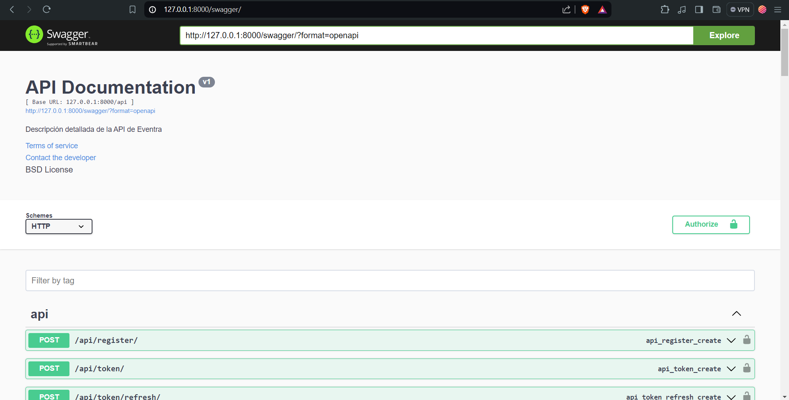
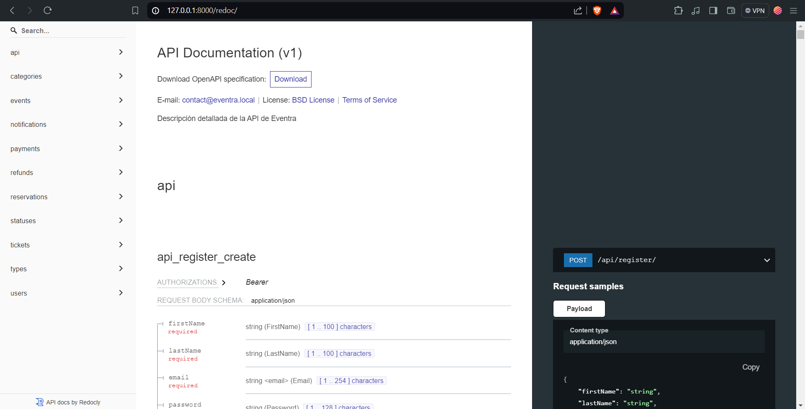
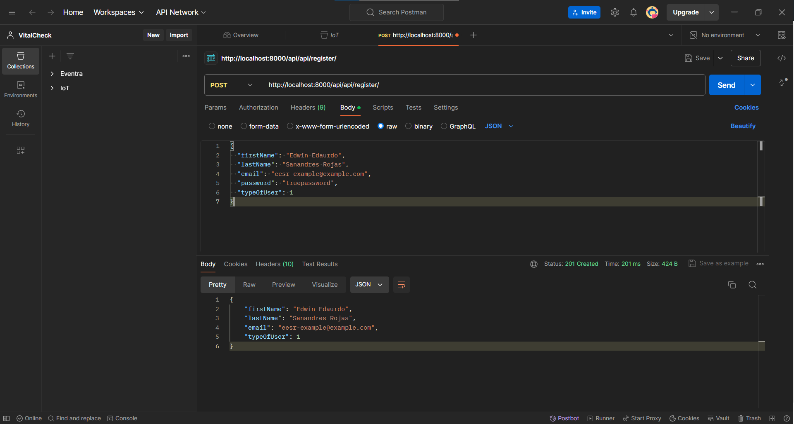
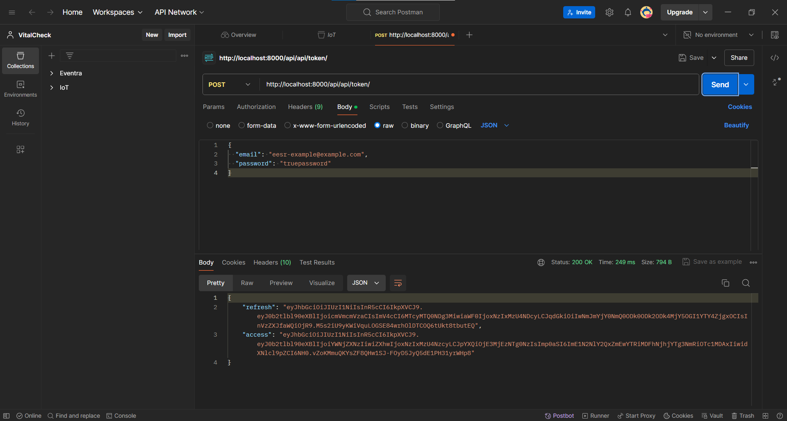
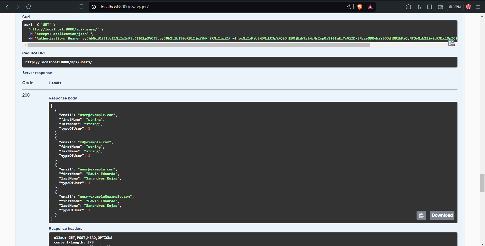

# Eventra-Django

## Descripción del Proyecto

Eventra es una aplicación web desarrollada con Django que permite la gestión de eventos. El proyecto incluye funcionalidades de autenticación, registro de usuarios, y gestión de categorías de eventos.

## Instalación


1. Clona el repositorio:

   ```sh
   git clone https://github.com/EEduardoSanandres/Eventra-Django.git
   cd Eventra-Django/Eventra
   ```

2. Crea y activa un entorno virtual:

   ```sh
   Copiar código
   python -m venv env
   env\Scripts\activate  # En Windows
   source env/bin/activate  # En macOS/Linux
   ```
3. Instala las dependencias:

   ```sh
   Copiar código
   pip install -r requirements.txt
   ```
   
4. Configura la base de datos en settings.py y realiza las migraciones:

   ```sh
   Copiar código
   python manage.py makemigrations
   python manage.py migrate
   ```
5. Crea un superusuario:

   ```sh
   Copiar código
   python manage.py createsuperuser
   ```

6. Inicia el servidor de desarrollo:

   ```sh
   Copiar código
   python manage.py runserver
   ```

## Screenshots:

# Swagger del backend:

URL: http://localhost:8000/swagger/



# Documentacion del backend: 

URL: http://localhost:8000/redoc/ 



## Pruebas de POSTMAN:



 